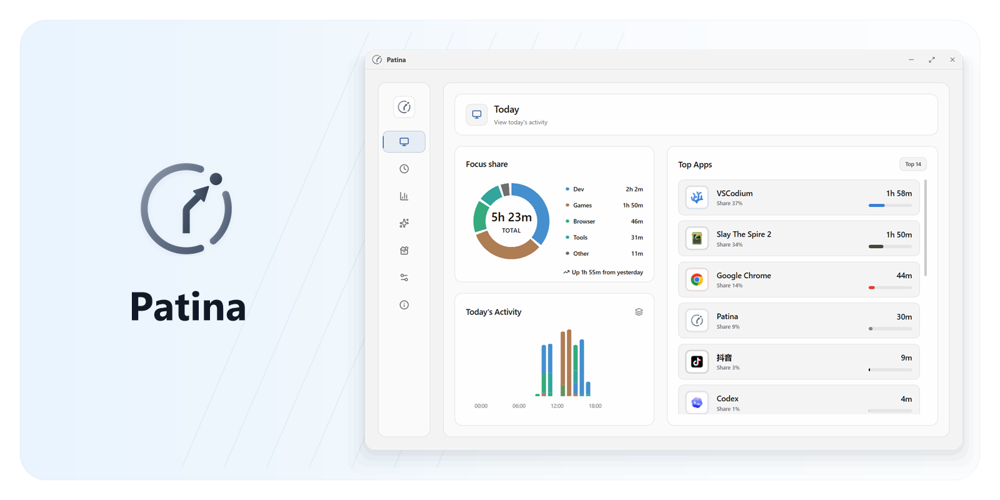
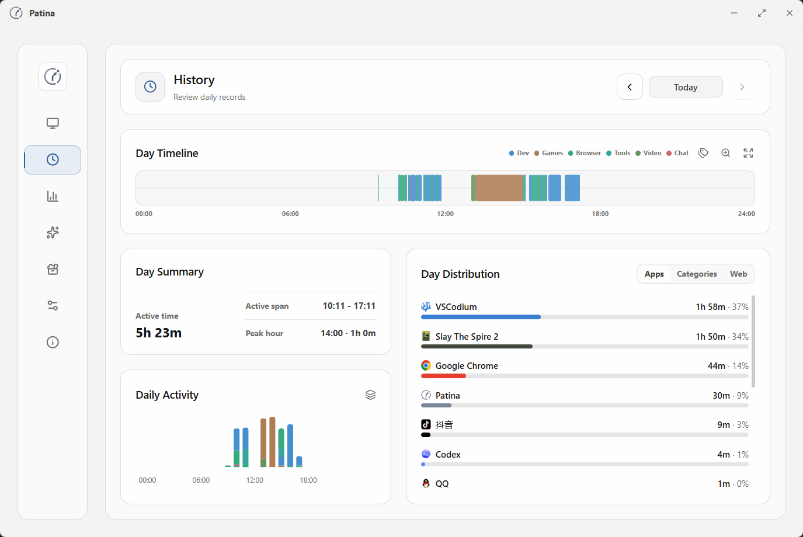
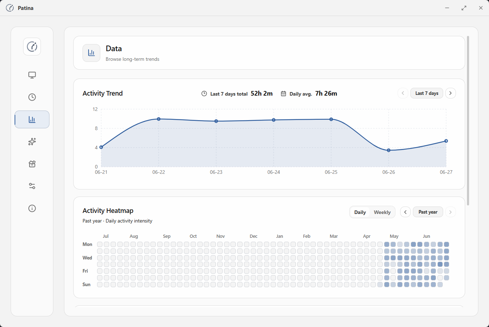
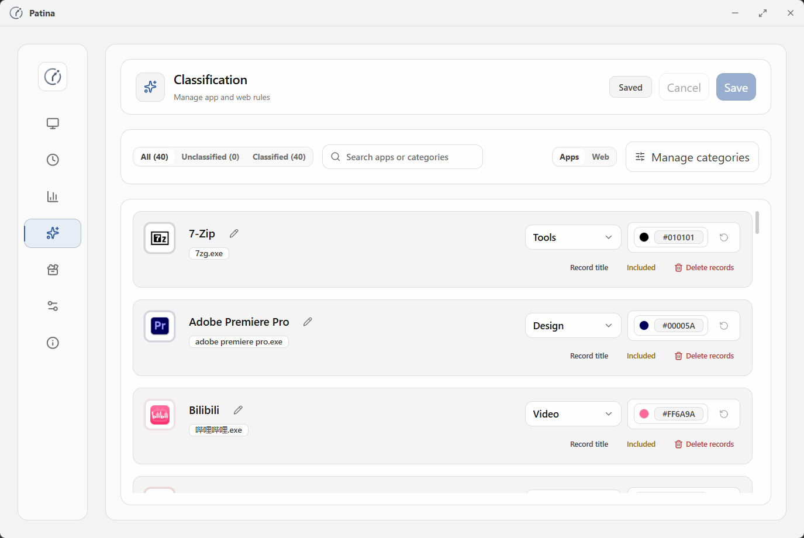
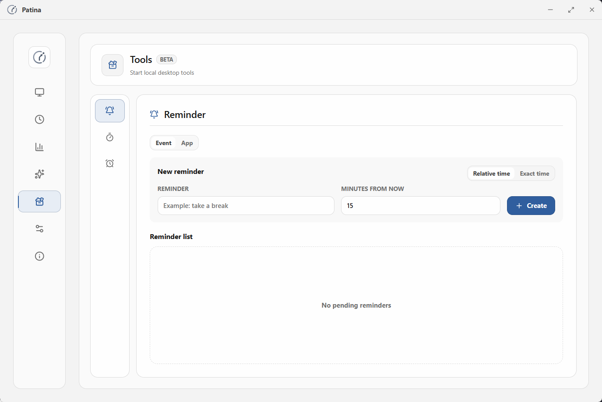
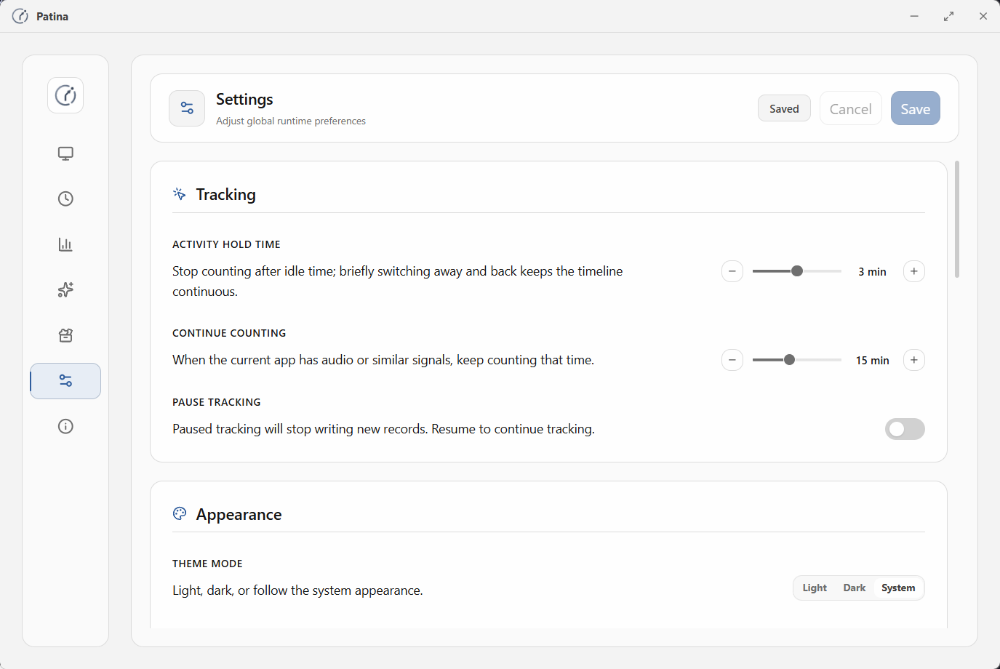
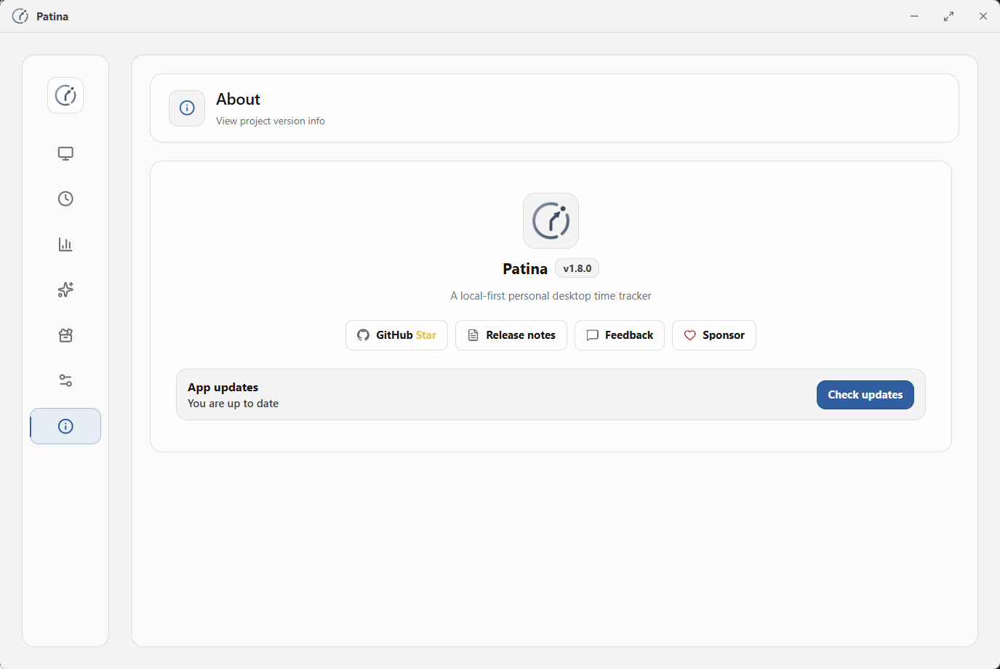

<div align="center">

# Patina

Local-first time tracking for Windows desktop work.

English · [简体中文](README.zh-CN.md)


[](LICENSE)
[](https://github.com/Ceceliaee/patina/releases)
[](https://github.com/Ceceliaee/patina/releases/latest)
[](https://github.com/Ceceliaee/patina/stargazers)

</div>


<p align="center">
Patina records foreground app usage as local, quiet, and trustworthy personal desktop time records.
</p>

<p align="center">
  
</p>

## Why Patina

- Records foreground apps automatically, without manually starting or stopping timers.
- Handles idle, lock, sleep, and abnormal-exit boundaries to keep records more trustworthy.
- Keeps data local by default, with no account, cloud sync, or server dependency.
- Lets you manage app names, categories, colors, stats exclusions, and window title capture.
- Provides lightweight local tools such as reminders, timers, and Pomodoro.
- Keeps the interface restrained, clear, and low-interruption for long-term daily use.

## Download

Prebuilt versions are published on GitHub Releases:

- [Download latest](https://github.com/Ceceliaee/patina/releases/latest)

Open the release page, download the Windows installer, and run it. Patina currently targets Windows 10/11 desktop use.

The Patina Web Sync browser extension is optional and is used to identify webpage titles in browsers.

## Core Features

### Automatic Tracking

- Automatically records the current foreground app and turns activity into time records.
- Detects idle, lock, and sleep states to reduce invalid time in statistics.
- Handles record boundaries after long-away periods and abnormal exits, reducing accidentally merged time.
- Reduces missed effective activity in low-interaction scenarios such as videos, meetings, courses, and livestreams.

### Review And Analysis

- Review effective activity, app rankings, and category distribution in today's overview.
- Use the timeline to review activity by date and inspect app switches and window title details.
- Understand long-term time distribution through trends, heatmaps, and app curves.

### Management And Control

- Rename apps and adjust categories, colors, and statistics rules.
- Exclude apps you do not want in statistics, or disable window title capture for specific apps.
- Export local backups, restore backups, and clean up historical records.

### Lightweight Tools

- Create one-off reminders and app usage limit reminders.
- Use stopwatch, countdown, and Pomodoro for active focus tasks.
- Tool state stays local and does not replace automatic tracking records.

## Interface Preview

<table>
  <tr>
    <td width="50%" align="center"><strong>History</strong></td>
    <td width="50%" align="center"><strong>Data</strong></td>
  </tr>
  <tr>
    <td width="50%"></td>
    <td width="50%"></td>
  </tr>
  <tr>
    <td width="50%" align="center"><strong>Classification</strong></td>
    <td width="50%" align="center"><strong>Tools</strong></td>
  </tr>
  <tr>
    <td width="50%"></td>
    <td width="50%"></td>
  </tr>
  <tr>
    <td width="50%" align="center"><strong>Settings</strong></td>
    <td width="50%" align="center"><strong>About</strong></td>
  </tr>
  <tr>
    <td width="50%"></td>
    <td width="50%"></td>
  </tr>
</table>

## Reliability And Privacy

Time tracking has long-term value only when the records are trustworthy. Patina focuses on these boundaries:

- **Foreground app recognition**: records the window and app that are actually in the foreground, reducing temporary-window and system noise.
- **Idle handling**: idle time does not continue counting as effective activity.
- **State boundaries**: handles record boundaries after lock, sleep, resume, long-away periods, and abnormal exits.
- **Effective-duration stats**: rankings, distributions, and totals use effective activity time, not just open spans.
- **Title capture control**: window title capture can be disabled per app to reduce unnecessary sensitive information retention.
- **Local data control**: core data stays local, and backups, restores, and history cleanup are initiated by the user.

## Current Scope

Patina currently focuses on personal local time records:

- Windows 10/11 desktop use
- Personal local data storage and control
- Automatic tracking, review, classification, and backup or restore
- Lightweight local tools

It is not currently aimed at team collaboration, account systems, cloud sync, multi-platform sync, or heavy AI insights.

## Build From Source

### Requirements

- [Rust](https://www.rust-lang.org/tools/install)
- [Node.js](https://nodejs.org/) 18+

### Install Dependencies

```bash
git clone https://github.com/Ceceliaee/patina.git
cd patina
npm install
```

### Run In Development

```bash
npm run tauri dev
```

### Build Installer

```bash
npm run tauri build
```

Installers are generated under:

```text
src-tauri/target/release/bundle/
```

## Tech Stack

- Desktop shell: Tauri v2
- Backend: Rust
- Frontend: React + Vite + TypeScript
- Styling: Tailwind CSS
- Animation: Framer Motion
- Charts: Recharts
- Database: SQLite via `@tauri-apps/plugin-sql`
- Windows integration: `windows` crate

## Contributing

If you want to contribute, understand the product direction, or review architecture boundaries, start with [`CONTRIBUTING.md`](CONTRIBUTING.md#english).

## Feedback

If you run into a problem, notice unusual records, or want to suggest an improvement, you can use GitHub Issues:

- <https://github.com/Ceceliaee/patina/issues/new/choose>

## Support

Patina is a personal, local-first open-source project. If it has been useful in your daily life or work, you can support ongoing maintenance in whichever way is convenient:

<div align="center">
  <a href="https://ko-fi.com/ceceliaee"></a>
  <br><br>
  
</div>

Sponsorship helps sustain maintenance, but it does not affect feature priority, issue handling, the roadmap, or the product direction.

## Star History

<a href="https://www.star-history.com/?repos=Ceceliaee%2Fpatina">
 <picture>
   <source media="(prefers-color-scheme: dark)" srcset="https://api.star-history.com/chart?repos=Ceceliaee/patina&type=date&theme=dark&legend=top-left" />
   <source media="(prefers-color-scheme: light)" srcset="https://api.star-history.com/chart?repos=Ceceliaee/patina&type=date&legend=top-left" />
   
 </picture>
</a>

## License

[MIT](LICENSE)
