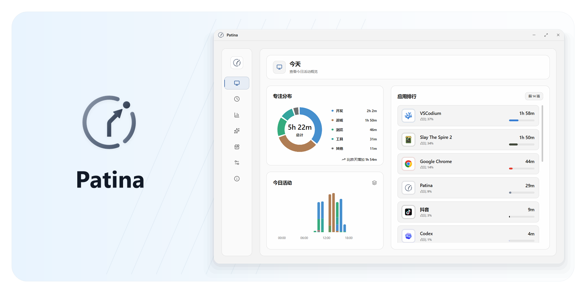
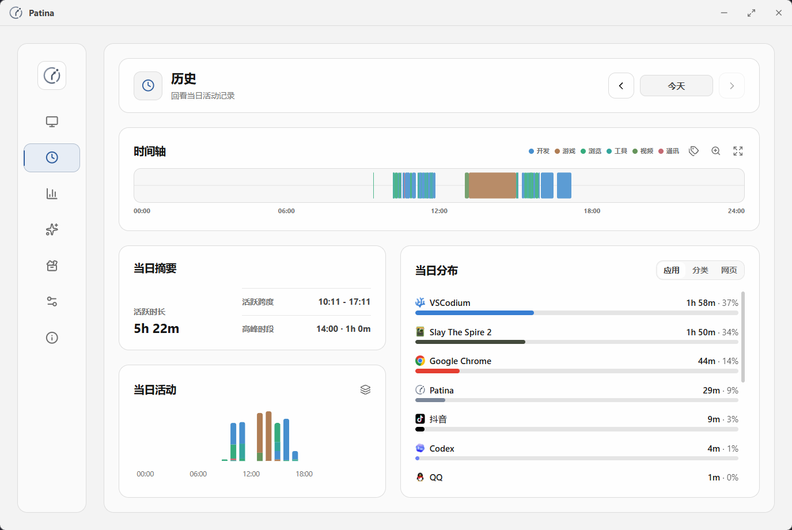
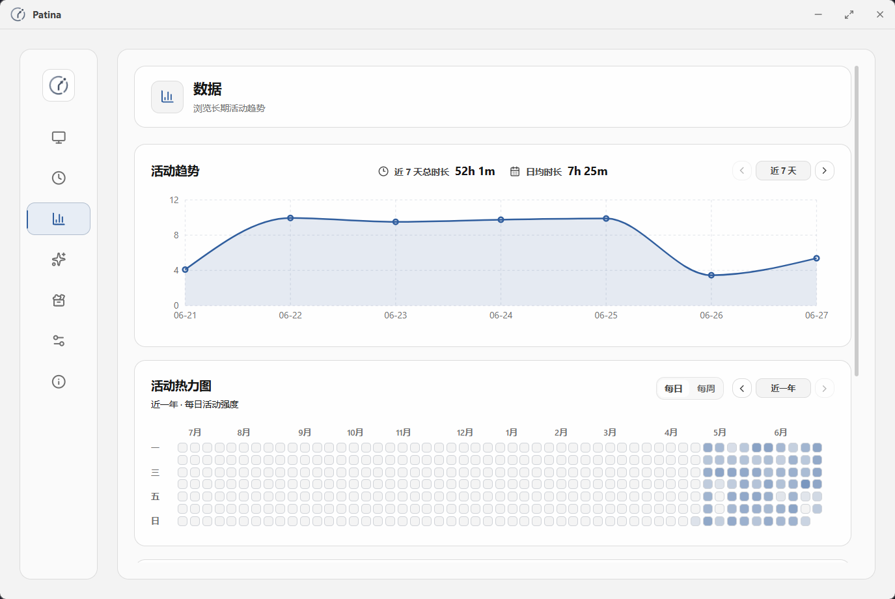
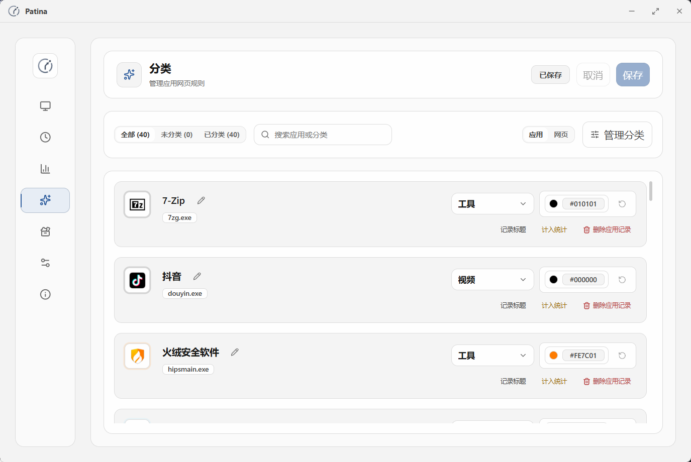
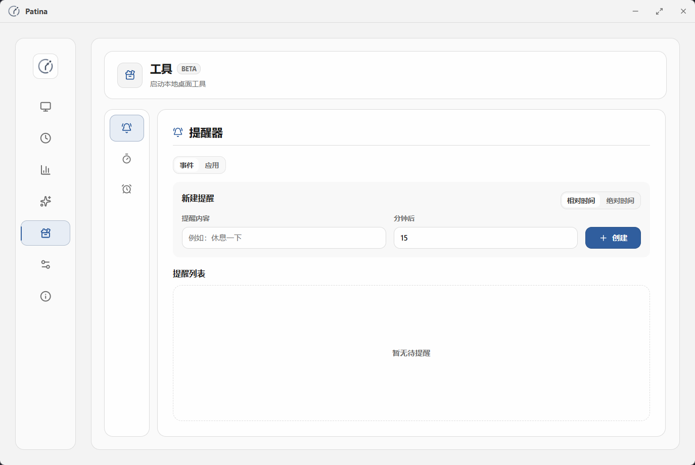
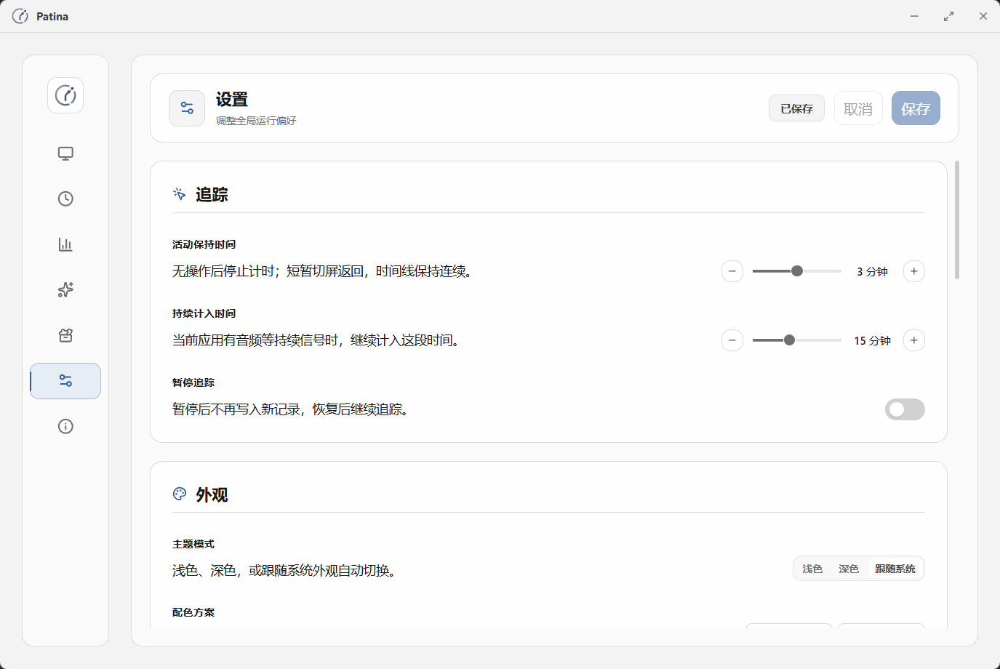
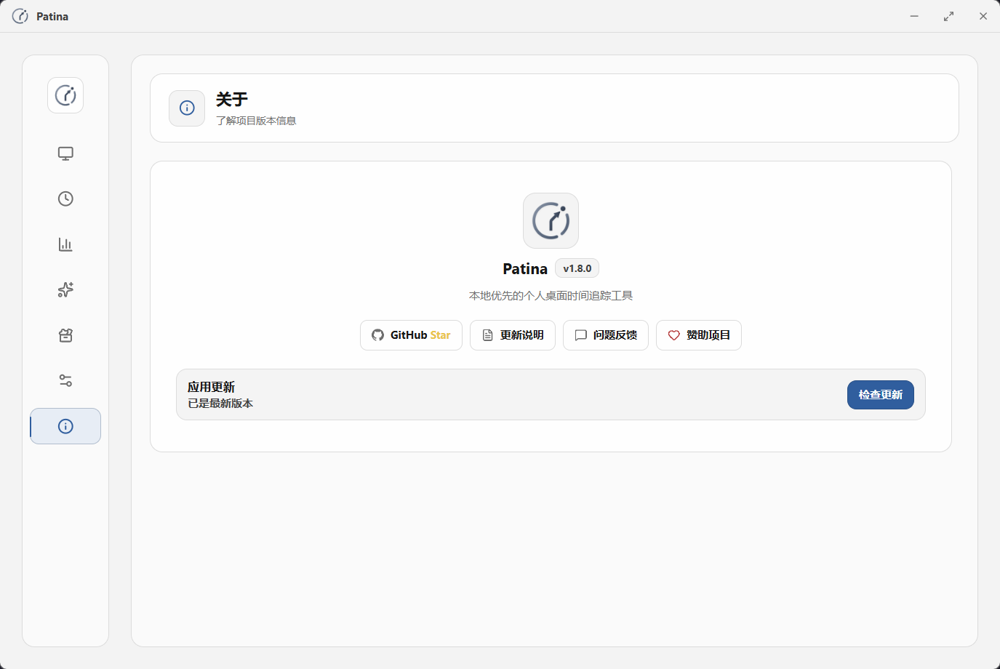
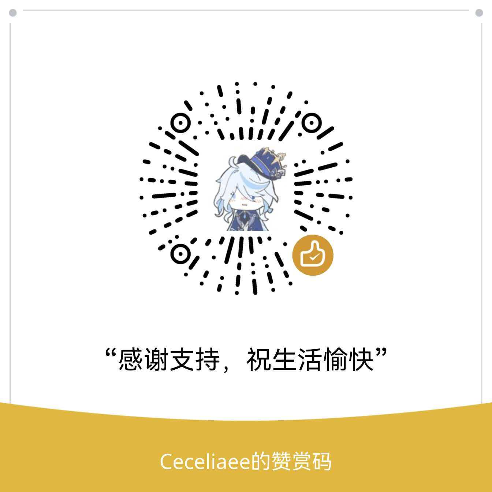

<div align="center">


# Patina

面向 Windows 桌面工作的本地优先时间追踪工具。

[English](README.md) · 简体中文


[](LICENSE)
[](https://github.com/Ceceliaee/patina/releases)
[](https://github.com/Ceceliaee/patina/releases/latest)
[](https://github.com/Ceceliaee/patina/stargazers)

</div>


<p align="center">
Patina 自动记录前台应用，整理成本地、安静、可信的个人桌面时间记录。
</p>

<p align="center">
  
</p>

## 为什么选择 Patina

- 自动记录前台应用，不需要手动开始或停止计时。
- 处理无操作、锁屏、睡眠、异常退出等边界，让记录更可信。
- 数据默认保存在本地，不依赖账号、云同步或服务器。
- 可以管理应用名称、分类、颜色、统计排除和窗口标题记录。
- 提供提醒、计时器和番茄钟等轻量本地工具。
- 界面保持克制、清晰、低打扰，适合长期日常使用。

## 下载

预构建版本发布在 GitHub Releases：

- [下载最新版](https://github.com/Ceceliaee/patina/releases/latest)

进入发布页后下载 Windows 安装包并运行即可。Patina 当前以 Windows 10/11 桌面使用为主要目标。

Patina Web Sync 浏览器扩展是可选组件，用于识别浏览器中的网页标题。

## 核心能力

### 自动追踪

- 自动记录当前前台应用，并按活动形成时间记录。
- 识别无操作、锁屏、睡眠等状态，减少无效时间混入统计。
- 处理长时间离开和异常退出后的记录边界，减少时间串记。
- 在视频、会议、课程、直播等低交互场景中，减少有效活动漏记。

### 回看与分析

- 在今日概览中查看有效活动、应用排行和分类分布。
- 使用时间轴按日期回看活动记录，查看应用切换和窗口标题明细。
- 通过趋势、热力图和应用曲线了解长期时间分布。

### 管理与控制

- 重命名应用，调整分类、颜色和统计规则。
- 排除不想纳入统计的应用，或关闭指定应用的窗口标题记录。
- 导出本地备份，恢复备份，清理历史记录。

### 轻量工具

- 创建一次性提醒和应用使用上限提醒。
- 使用计时、倒计时和番茄钟处理主动专注任务。
- 工具状态保留在本地，不替代自动追踪记录。

## 界面预览

<table>
  <tr>
    <td width="50%" align="center"><strong>历史</strong></td>
    <td width="50%" align="center"><strong>数据</strong></td>
  </tr>
  <tr>
    <td width="50%"></td>
    <td width="50%"></td>
  </tr>
  <tr>
    <td width="50%" align="center"><strong>分类</strong></td>
    <td width="50%" align="center"><strong>工具</strong></td>
  </tr>
  <tr>
    <td width="50%"></td>
    <td width="50%"></td>
  </tr>
  <tr>
    <td width="50%" align="center"><strong>设置</strong></td>
    <td width="50%" align="center"><strong>关于</strong></td>
  </tr>
  <tr>
    <td width="50%"></td>
    <td width="50%"></td>
  </tr>
</table>

## 可靠性与隐私

时间追踪只有在结果可信时才有长期价值。Patina 重点保护这些边界：

- **前台应用识别**：记录真实位于前台的窗口和应用，减少临时窗口与系统噪音干扰。
- **无操作处理**：无操作时间不会继续被算作有效活动。
- **状态边界**：处理锁屏、睡眠、恢复、长时间离开和异常退出后的记录边界。
- **有效时长统计**：排行、分布和总时长基于有效活动时间，而不是单纯的打开时段。
- **标题记录控制**：窗口标题记录可以按应用关闭，减少不必要的敏感信息保留。
- **本地数据控制**：核心数据保存在本地，备份、恢复和历史清理由用户主动管理。

## 当前范围

Patina 目前专注于个人本地时间记录：

- Windows 10/11 桌面使用
- 个人本地数据存储与控制
- 自动追踪、回看、分类和备份恢复
- 轻量本地工具

它目前不面向团队协作、账号体系、云同步、多平台同步或重型 AI 洞察。

## 从源码运行

### 环境要求

- [Rust](https://www.rust-lang.org/tools/install)
- [Node.js](https://nodejs.org/) 18+

### 安装依赖

```bash
git clone https://github.com/Ceceliaee/patina.git
cd patina
npm install
```

### 开发运行

```bash
npm run tauri dev
```

### 构建安装包

```bash
npm run tauri build
```

安装包会生成在：

```text
src-tauri/target/release/bundle/
```

## 技术栈

- 桌面壳：Tauri v2
- 后端：Rust
- 前端：React + Vite + TypeScript
- 样式：Tailwind CSS
- 动效：Framer Motion
- 图表：Recharts
- 数据库：SQLite，通过 `@tauri-apps/plugin-sql`
- Windows 集成：`windows` crate

## 贡献

如果你要参与贡献、了解产品方向或审查架构边界，建议先阅读 [`CONTRIBUTING.md`](CONTRIBUTING.md#zh-cn)。

## 反馈

如果你遇到问题、发现记录异常，或想提出改进建议，可以通过 GitHub Issues 反馈：

- <https://github.com/Ceceliaee/patina/issues/new/choose>

## 支持项目

Patina 是一个个人维护的、本地优先开源项目。如果它对你的日常生活或工作有帮助，也欢迎选择方便的方式支持后续维护：

<div align="center">
  <a href="https://ko-fi.com/ceceliaee"></a>
  <br><br>
  
</div>

赞助会帮助项目持续维护，但不会影响功能优先级、问题处理方式、路线图或产品方向。

## Star History

<a href="https://www.star-history.com/?repos=Ceceliaee%2Fpatina">
 <picture>
   <source media="(prefers-color-scheme: dark)" srcset="https://api.star-history.com/chart?repos=Ceceliaee/patina&type=date&theme=dark&legend=top-left" />
   <source media="(prefers-color-scheme: light)" srcset="https://api.star-history.com/chart?repos=Ceceliaee/patina&type=date&legend=top-left" />
   
 </picture>
</a>

## 许可证

[MIT](LICENSE)
